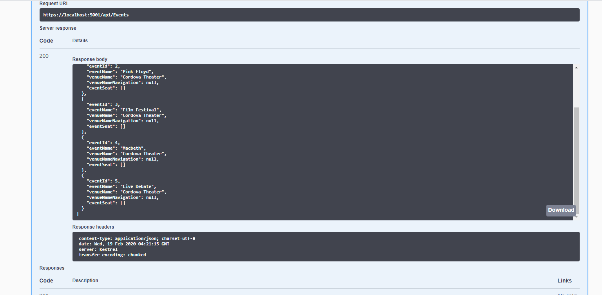

# Ticket API System.

The API is fully documented at it's hosted location using Swagger UI: 

<a href="https://ticketapi20200218060440.azurewebsites.net/index.html" target="_blank"> Click here for Swagger UI Page</a>
 
 
 

This is an API providing a service for a ticket purchasing system. Developers can use this API to update the Azure hosted database to record purchase and event data for various venues.

 The API has fully exposed POST, PUT, DELETE, GET, ect methods for adding event or purchase information to the Azure database.

 The API has been fully seeded with an event which demonstates that a single row has been sold out for an example event: 

  

 

The API has been structured logically in such a way that while developers can add event and purcahse information to the database, they can not for example remove sections, rows, or other elements of the venue as these methods have not been exposed.

<h3> NOTE: </h3>

 There is an unkown 500 error currently occuring on the server, however here it was a correct responce once pulled appears locally:

  
